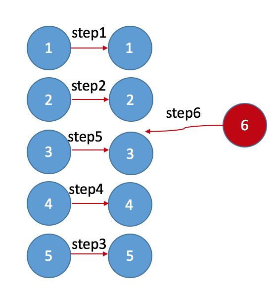

## Virtual DOM 的数据更新与UI同步机制


在数据和真实 DOM 之间建立了一层缓冲，数据变化了调用 vue 的渲染方法，不是直接得到新的 DOM 进行替换，先生成 Virtual DOM，与上一次进行比对，如果发现变化，将变化的地方更新到真实 DOM 。


## Virtual DOM的结构
[vue](https://github.com/vuejs/vue)

[snabbdom](https://github.com/snabbdom/snabbdom)

* 元素类型
* 元素属性
* 元素的子节点

## 虚拟DOM树比较


## DOM diff（四个纬度比较）
```XML
<section>
    <div v-if="a==1">
        <div>测试1</div>
        <p>内容2</p>
        <div>内容3</div>
        <p>内容4</p>
    </div>
    <div v-if="a==2">
        <p>内容4</p>
        <p>内容2</p>
        <div>内容3</div>
    </div>
</section>
```

## DOM diff（以key为标准）

## 经典的图
